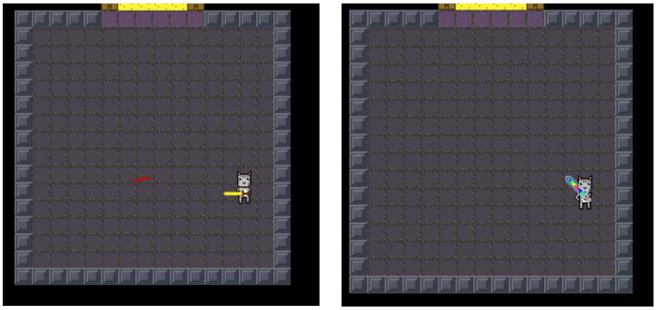
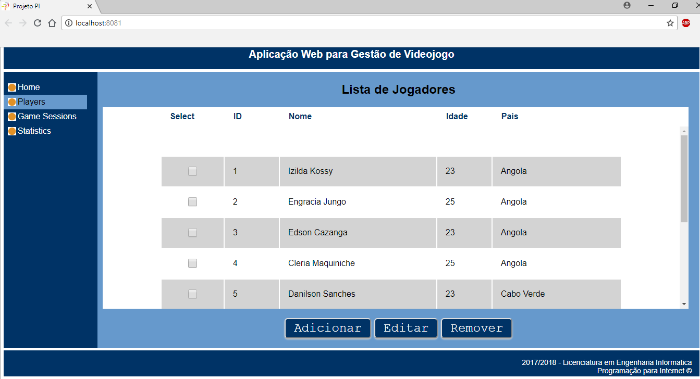
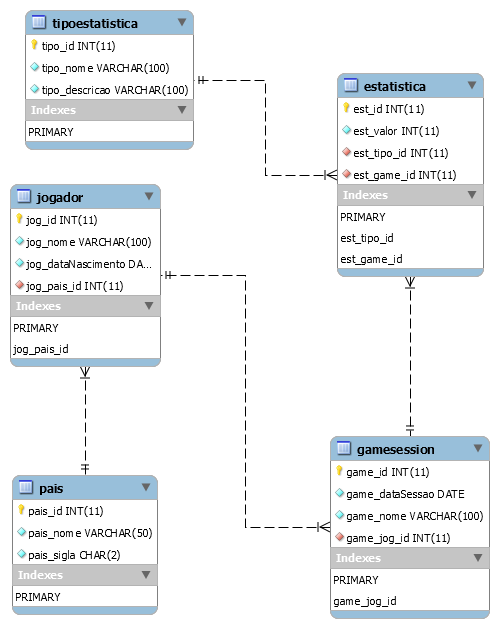

# Projeto PI - FASE 1
Programação para a Internet 2018

### Aplicação Web a realizar
Aplicação Web para Gestão de Videojogo

### Ambiente Tecnologico
Visual Studio Code, MySQL, Node.js, HTML, CSS, Javascripts, Rest, Json, Unity 3D

### Descrição do jogo
O jogo baseia‐se na história de Pookie, um valente gatinho cinza que fora raptado por um grupo de
ratos malignos e levado para um calabouço, do qual irá tentar escapar, lutando contra os ratos. Com
o seu olhar laser e a sua espada, ele defende‐se e derrota os ratos malvados até, finalmente, conseguir 
chegar ao portal e passar para o nível seguinte do calabouço. Durante a sua aventura, ele encontrará moedas mágicas que poderão ser trocadas por itens que irão aumentar a sua força.

